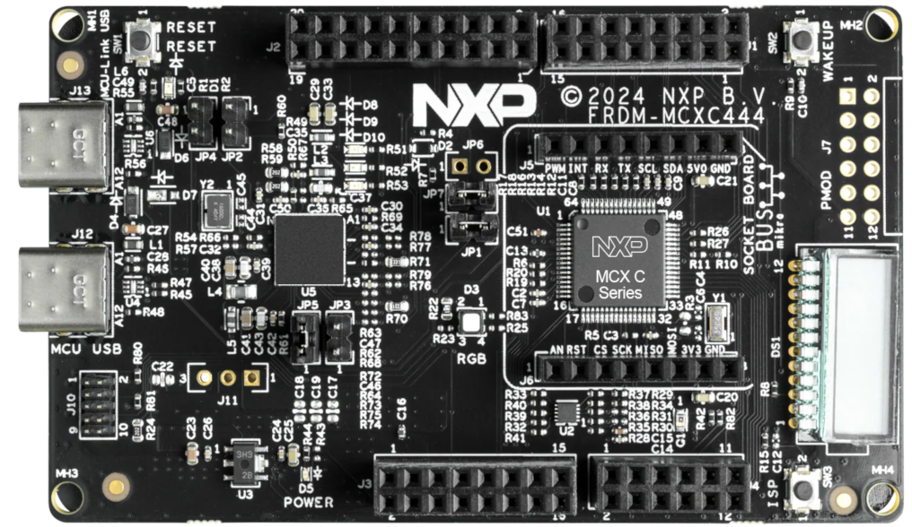
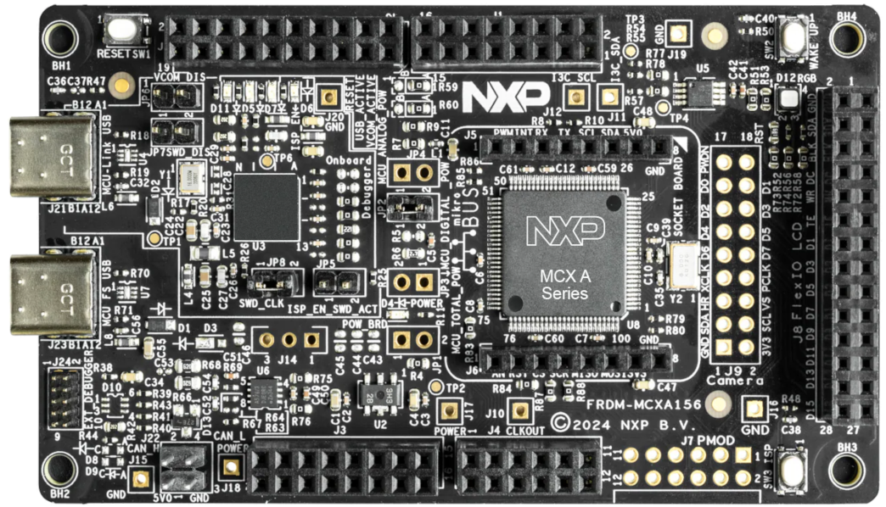
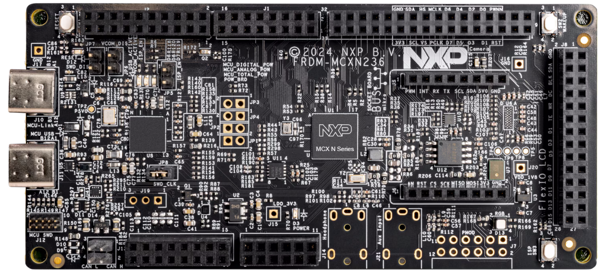
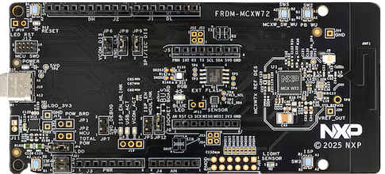
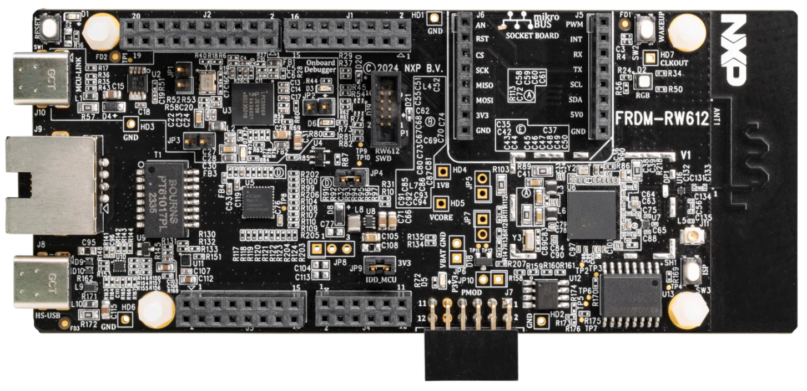
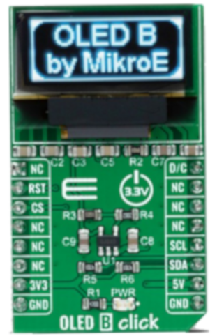

# NXP Application Code Hub

## Demo of mikroe OledBclick in FRDM with CMSIS driver and GPIO adapter
This demo is an example for the Mikroe OLED B click module using FRDM boards with CMSIS driver for I2C comunication and a GPIO adapter.

This example supports multiple FRDM boards, listed below.

**Supported FRDM boards**
- FRDM MCXC041   
[

](Common/Images/MCXC041.png)
- FRDM MCXC242   
[

](Common/Images/MCXC242.png)
- FRDM MCXC444   
[

](Common/Images/MCXC444.png)
- FRDM MCXA153   
[

](Common/Images/MCXA153.png)
- FRDM MCXA156   
[

](Common/Images/MCXA156.png)
- FRDM MCXN236   
[

](Common/Images/MCXN236.png)
- FRDM MCXN947   
[

](Common/Images/MCXN947.png)
- FRDM MCXW72   
[

](Common/Images/MCXW72.png)
- FRDM RW612   
[

](Common/Images/RW612.png)

#### Boards: FRDM-MCXA156, FRDM-MCXN236, FRDM-MCXA153, FRDM-MCXN947, FRDM-MCXC444, FRDM-MCXC041, FRDM-MCXC242, FRDM-RW612, FRDM-MCXW72
#### Categories: HMI, Graphics, User Interface
#### Peripherals: GPIO, I2C, UART
#### Toolchains: MCUXpresso IDE, VS Code

## Table of Contents
1. [Software](#step1)
2. [Hardware](#step2)
3. [Setup](#step3)
4. [Results](#step4)
5. [Release Notes](#step5)

## 1. Software
- [MCUXpresso for VScode 24.8.9 or newer](https://www.nxp.com/products/processors-and-microcontrollers/arm-microcontrollers/general-purpose-mcus/lpc800-arm-cortex-m0-plus-/mcuxpresso-for-visual-studio-code:MCUXPRESSO-VSC?cid=wechat_iot_303216)
- [SDK for FRDM board](https://mcuxpresso.nxp.com/en/select)

## 2. Hardware 
- [FRDM](https://www.nxp.com/design/design-center/development-boards-and-designs/frdm-development-boards:FRDM) 
- [MIKROE OLED-B-CLICK](https://www.mikroe.com/oled-b-click)   
[

](Common/Images/OledBClick.png)

## 3. Setup
Refer to the README file in the corresponding project folder for board specific setup and build instructions:
- [FRDM MCXC041](dm-mikroe-oledBclick-frdm-mcxc041\README.md) 
- [FRDM MCXC242](dm-mikroe-oledBclick-frdm-mcxc242\README.md)   
- [FRDM MCXC444](dm-mikroe-oledBclick-frdm-mcxc444\README.md)      
- [FRDM MCXA153](dm-mikroe-oledBclick-frdm-mcxa153\README.md)      
- [FRDM MCXA156](dm-mikroe-oledBclick-frdm-mcxa156\README.md)      
- [FRDM MCXN236](dm-mikroe-oledBclick-frdm-mcxn236\README.md)      
- [FRDM MCXN947](dm-mikroe-oledBclick-frdm-mcxn947\README.md)      
- [FRDM MCXW72](dm-mikroe-oledBclick-frdm-mcxw72\README.md)      
- [FRDM RW612](dm-mikroe-oledBclick-frdm-rw612\README.md)      

## 4. Results
Demonstration results are documented in the README file of each specific project folder.

#### Project Metadata

<!----- Boards ----->

<!----- Categories ----->

<!----- Peripherals ----->

<!----- Toolchains ----->

Questions regarding the content/correctness of this example can be entered as Issues within this GitHub repository.

>**Warning**: For more general technical questions regarding NXP Microcontrollers and the difference in expected functionality, enter your questions on the [NXP Community Forum](https://community.nxp.com/)

## 5. Release Notes
| Version | Description / Update                                           | Date                            |
|:-------:|----------------------------------------------------------------|--------------------------------:|
| 1.0     | Initial release on Application Code Hub                        | September 30 th 2024 |
| 2.0     | Ported all projects to VS Code and replaced MCXW71 with MCXW72 | May 11 th 2026       |

<small>
<b>Trademarks and Service Marks</b>: There are a number of proprietary logos, service marks, trademarks, slogans and product designations ("Marks") found on this Site. By making the Marks available on this Site, NXP is not granting you a license to use them in any fashion. Access to this Site does not confer upon you any license to the Marks under any of NXP or any third party's intellectual property rights. While NXP encourages others to link to our URL, no NXP trademark or service mark may be used as a hyperlink without NXP’s prior written permission. The following Marks are the property of NXP. This list is not comprehensive; the absence of a Mark from the list does not constitute a waiver of intellectual property rights established by NXP in a Mark.
</small>
 
<small>
NXP, the NXP logo, NXP SECURE CONNECTIONS FOR A SMARTER WORLD, Airfast, Altivec, ByLink, CodeWarrior, ColdFire, ColdFire+, CoolFlux, CoolFlux DSP, DESFire, EdgeLock, EdgeScale, EdgeVerse, elQ, Embrace, Freescale, GreenChip, HITAG, ICODE and I-CODE, Immersiv3D, I2C-bus logo , JCOP, Kinetis, Layerscape, MagniV, Mantis, MCCI, MIFARE, MIFARE Classic, MIFARE FleX, MIFARE4Mobile, MIFARE Plus, MIFARE Ultralight, MiGLO, MOBILEGT, NTAG, PEG, Plus X, POR, PowerQUICC, Processor Expert, QorIQ, QorIQ Qonverge, RoadLink wordmark and logo, SafeAssure, SafeAssure logo , SmartLX, SmartMX, StarCore, Symphony, Tower, TriMedia, Trimension, UCODE, VortiQa, Vybrid are trademarks of NXP B.V. All other product or service names are the property of their respective owners. © 2021 NXP B.V.
</small>