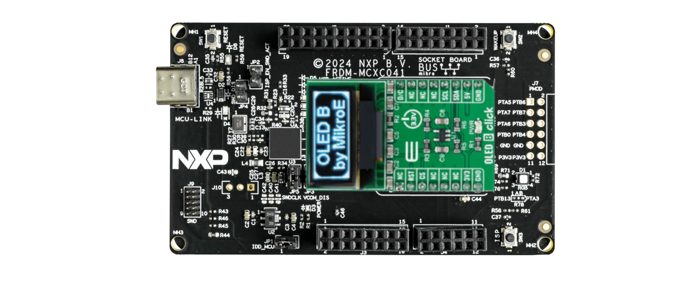
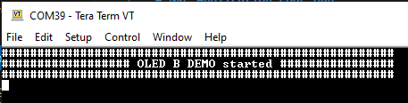
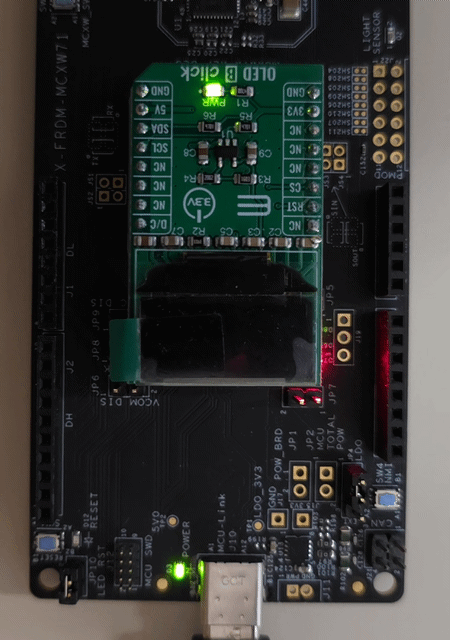

# NXP Application Code Hub

## Demo of mikroe oledBclick in FRDM with CMSIS driver and GPIO adapter

Demo is an example for Mikroe OLED B click module in FRDM boards usign CMSIS driver for I2C comunication, and GPIO component.

Mikroe OLED B click demo is in [This repository](https://github.com/nxp-appcodehub/dm-mikroe-oledBclick-frdm)
and is supported for many boards that are divided in branches.
### Branches for specific boards
- [FRDM MCXC041](https://github.com/nxp-appcodehub/dm-mikroe-oledBclick-frdm/tree/mcx-c041)
- [FRDM MCXC242](https://github.com/nxp-appcodehub/dm-mikroe-oledBclick-frdm/tree/mcx-c242)
- [FRDM MCXC444](https://github.com/nxp-appcodehub/dm-mikroe-oledBclick-frdm/tree/mcx-c444)
- [FRDM MCXCA153](https://github.com/nxp-appcodehub/dm-mikroe-oledBclick-frdm/tree/mcx-a153)
- [FRDM MCXCA156](https://github.com/nxp-appcodehub/dm-mikroe-oledBclick-frdm/tree/mcx-a156)
- [FRDM MCXCN236](https://github.com/nxp-appcodehub/dm-mikroe-oledBclick-frdm/tree/mcx-n236)
- [FRDM MCXCN947](https://github.com/nxp-appcodehub/dm-mikroe-oledBclick-frdm/tree/mcx-n247)
- [FRDM MCXCW71](https://github.com/nxp-appcodehub/dm-mikroe-oledBclick-frdm/tree/mcx-w71)
- [FRDM RW612](https://github.com/nxp-appcodehub/dm-mikroe-oledBclick-frdm/tree/rw612)
#### Boards: FRDM-MCXN947, FRDM-RW612, FRDM-MCXW71, FRDM-MCXA153, FRDM-MCXA156, FRDM-MCXC041, FRDM-MCXC242, FRDM-MCXC444, FRDM-MCXN236
#### Categories: Graphics, HMI, User Interface
#### Peripherals: GPIO, I2C, UART
#### Toolchains: MCUXpresso IDE, VS Code

## Table of Contents
1. [Software](#step1)
2. [Hardware](#step2)
3. [Setup](#step3)
4. [Results](#step4)
5. [FAQs](#step5) 
6. [Support](#step6)
7. [Release Notes](#step7)

## 1. Software
- [MCUXpresso 11.10.0 or newer.](https://nxp.com/mcuxpresso)
- [MCUXpresso for VScode 24.8.9 or newer](https://www.nxp.com/products/processors-and-microcontrollers/arm-microcontrollers/general-purpose-mcus/lpc800-arm-cortex-m0-plus-/mcuxpresso-for-visual-studio-code:MCUXPRESSO-VSC?cid=wechat_iot_303216)
- [SDK for FRDM board](https://mcuxpresso.nxp.com/en/select)

## 2. Hardware
- [FRDM-MCXC041](https://www.nxp.com/design/design-center/development-boards-and-designs/general-purpose-mcus/frdm-development-board-for-mcx-n94-n54-mcus:FRDM-MCXC041)   
[

](https://www.nxp.com/assets/images/en/dev-board-image/FRDM-MCXC041-TOP.jpg)
- [MIKROE OLED-B-CLICK](https://www.mikroe.com/oled-b-click)   
[

](https://cdn1-shop.mikroe.com/img/product/oled-b-click/oled-b-click-thickbox_default-1.jpg)

## 3. Setup

### 3.1 Plug Mikroe Joystick-2-click in FRDM-MCXC041
[

](Images/plug.png) 
### 3.2 Upload code in FRDM-MCXC041

## 4. Results
    - Open serial monitor with next configuration
        - Baudrate:  9600
        - Parity:    None
        - StopBits:  1
    - Reset FRDM-MCXC041 with SW1
    - Serial monitor should shows next
[

](Images/Terminal.JPG) 
OLED screen should show next
[

](Images/oledBclick.gif)

### Convert Images
Demo includes python script to resize and convert ever image to binary for the screen. 
- Run script on CMD and type the root and name of image to convert. 
[

](Images/script_results.PNG)
- Script generates .c file with the image array. 
[

](Images/file_generated.PNG)
#### Project Metadata

<!----- Boards ----->

<!----- Categories ----->

<!----- Peripherals ----->

<!----- Toolchains ----->

Questions regarding the content/correctness of this example can be entered as Issues within this GitHub repository.

>**Warning**: For more general technical questions regarding NXP Microcontrollers and the difference in expected functionality, enter your questions on the [NXP Community Forum](https://community.nxp.com/)

## 7. Release Notes
| Version | Description / Update                           | Date                        |
|:-------:|------------------------------------------------|----------------------------:|
| 1.0     | Initial release on Application Code Hub        | September 23rd 2024 |