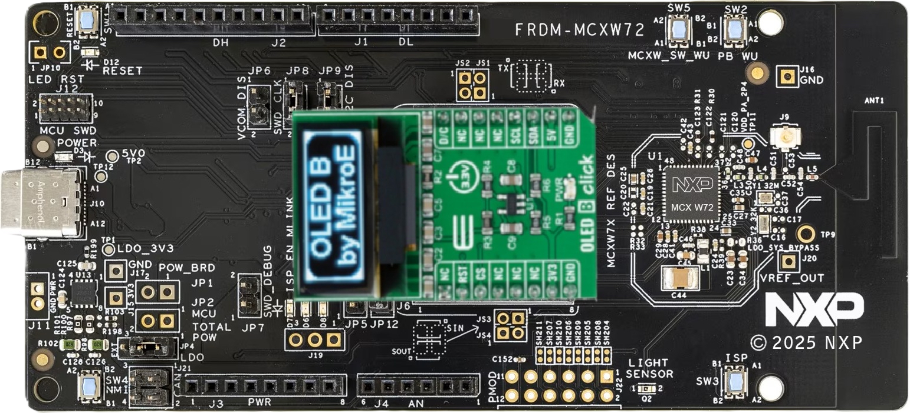
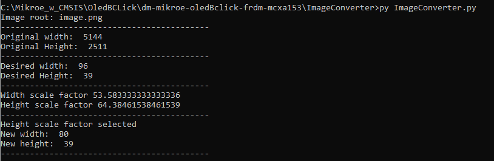
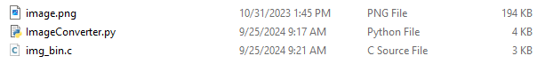

# NXP Application Code Hub

## Demo of mikroe OledBclick in FRDM-MCXW72 with CMSIS driver and GPIO adapter
This demo is an example for the Mikroe OLED B click module using FRDM boards with CMSIS driver for I2C comunication and a GPIO adapter. The demo is available for multiple FRDM boards, listed below.

**Supported FRDM boards**
- FRDM MCXC041
- FRDM MCXC242
- FRDM MCXC444
- FRDM MCXA153
- FRDM MCXA156
- FRDM MCXN236
- FRDM MCXN947
- **FRDM-MCXW72**
- FRDM RW612
>Note: This project folder targets a specific FRDM board. Projects for the other supported boards can be found in [this repository](https://github.com/nxp-appcodehub/dm-mikroe-oledBclick-frdm).
 
#### Boards: FRDM-MCXA156, FRDM-MCXN236, FRDM-MCXA153, FRDM-MCXN947, FRDM-MCXC444, FRDM-MCXC041, FRDM-MCXC242, FRDM-RW612, FRDM-MCXW72
#### Categories: HMI, Graphics, User Interface
#### Peripherals: GPIO, I2C, UART
#### Toolchains: MCUXpresso IDE, VS Code

## Table of Contents
1. [Software](#step1)
2. [Hardware](#step2)
3. [Setup](#step3)
4. [Results](#step4)
5. [Release Notes](#step5)

## 1. Software
- [VSCode (1.116.0)](https://code.visualstudio.com/)
- [MCUXpresso for VSCode extension (26.4.72)](https://marketplace.visualstudio.com/items?itemName=NXPSemiconductors.mcuxpresso)
- [SDK version 26.3.0](https://github.com/nxp-mcuxpresso/mcuxsdk-core)
  
## 2. Hardware 
- [FRDM-MCXW72](https://www.nxp.com/design/design-center/development-boards-and-designs/FRDM-MCXW72)   
[

](../Common/Images/MCXW72.png)
- [MIKROE OLED-B-CLICK](https://www.mikroe.com/oled-b-click)   
[

](../Common/Images/OledBClick.png)

## 3. Setup
### 3.1 Prepare before importing code
1. [Install VSCode.](https://www.nxp.com/design/design-center/training/TIP-GETTING-STARTED-WITH-MCUXPRESSO-FOR-VS-CODE)
2. [Install MCUXpresso for VSCode extension.](https://www.nxp.com/design/design-center/training/TIP-GETTING-STARTED-WITH-MCUXPRESSO-FOR-VS-CODE)
3. [Import SDK repository (Import could be take about an hour).](https://www.nxp.com/design/design-center/training/TIP-GETTING-STARTED-WITH-MCUXPRESSO-FOR-VS-CODE)
    - Open MCUXpresso for VSCode extension.
    - In Quick Start Panel window click in Import Repository.
    - Select MCUXpresso SDK repository.
    - Select main revision or specific if is needed.
    - Select save location.
    - Click import.
    - Import could take around an hour.

### 3.2 Import example from Application Code Hub
1. Open MCUXpresso for VSCode extension.
2. In the *Quick Start Panel*, select *Application Code Hub*.
3. In *Search* text field, type the name of the desired example.
4. Select the example and enter a name for the application as well as the directory where it will be saved.
5. Click *Import Project* and wait a few seconds.

### 3.3 Connect Mikroe OLED B Click to FRDM-MCXW72
[

](../Common/Images/plug_MCXW72.png) 

### 3.4 Run your demo application
1. Connect a USB cable between the host PC and the FRDM board
2. Open a serial terminal on PC for each board with the following settings:
    - 115200 baud rate
    - 8 data bits
    - No parity
    - One stop bit
    - No flow control
3. Download the program to the target board.
4. Either press the reset button on your board or launch the debugger in your IDE to begin running the demo.

## 4. Results
The serial monitor will print a message upon startup:
[

](../Common/Images/Terminal.PNG) 

The OledB screen will start cycling through the predefined images:
[

](../Common/Images/oledBclick.gif)

### Convert Images
This demo includes a Python script that resizes images and converts them into a binary format suitable for the OLED screen. 
- Run the script from the command line and provide the path and filename of the image to be converted. 
[

](../Common/Images/script_results.PNG)
- The script generates a .c source file containing the image data as an array, ready to be included in the project. 
[

](../Common/Images/file_generated.PNG) 

#### Project Metadata

<!----- Boards ----->

<!----- Categories ----->

<!----- Peripherals ----->

<!----- Toolchains ----->

Questions regarding the content/correctness of this example can be entered as Issues within this GitHub repository.

>**Warning**: For more general technical questions regarding NXP Microcontrollers and the difference in expected functionality, enter your questions on the [NXP Community Forum](https://community.nxp.com/)

## 5. Release Notes
| Version | Description / Update                                           | Date                            |
|:-------:|----------------------------------------------------------------|--------------------------------:|
| 1.0     | Initial release on Application Code Hub                        | September 30 th 2024 |
| 2.0     | Added support for FRDM-MCXW72                                  | May 11 th 2026       |

<small>
<b>Trademarks and Service Marks</b>: There are a number of proprietary logos, service marks, trademarks, slogans and product designations ("Marks") found on this Site. By making the Marks available on this Site, NXP is not granting you a license to use them in any fashion. Access to this Site does not confer upon you any license to the Marks under any of NXP or any third party's intellectual property rights. While NXP encourages others to link to our URL, no NXP trademark or service mark may be used as a hyperlink without NXP’s prior written permission. The following Marks are the property of NXP. This list is not comprehensive; the absence of a Mark from the list does not constitute a waiver of intellectual property rights established by NXP in a Mark.
</small>
 
<small>
NXP, the NXP logo, NXP SECURE CONNECTIONS FOR A SMARTER WORLD, Airfast, Altivec, ByLink, CodeWarrior, ColdFire, ColdFire+, CoolFlux, CoolFlux DSP, DESFire, EdgeLock, EdgeScale, EdgeVerse, elQ, Embrace, Freescale, GreenChip, HITAG, ICODE and I-CODE, Immersiv3D, I2C-bus logo , JCOP, Kinetis, Layerscape, MagniV, Mantis, MCCI, MIFARE, MIFARE Classic, MIFARE FleX, MIFARE4Mobile, MIFARE Plus, MIFARE Ultralight, MiGLO, MOBILEGT, NTAG, PEG, Plus X, POR, PowerQUICC, Processor Expert, QorIQ, QorIQ Qonverge, RoadLink wordmark and logo, SafeAssure, SafeAssure logo , SmartLX, SmartMX, StarCore, Symphony, Tower, TriMedia, Trimension, UCODE, VortiQa, Vybrid are trademarks of NXP B.V. All other product or service names are the property of their respective owners. © 2021 NXP B.V.
</small>

